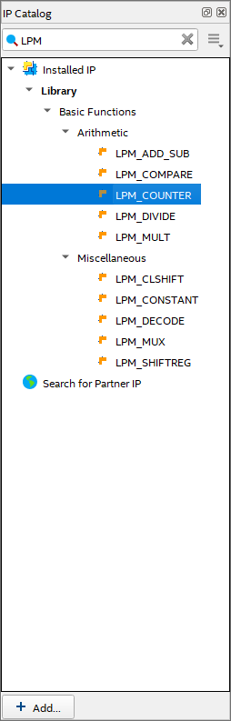
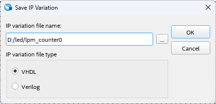
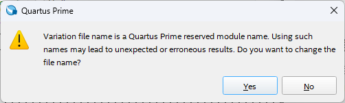
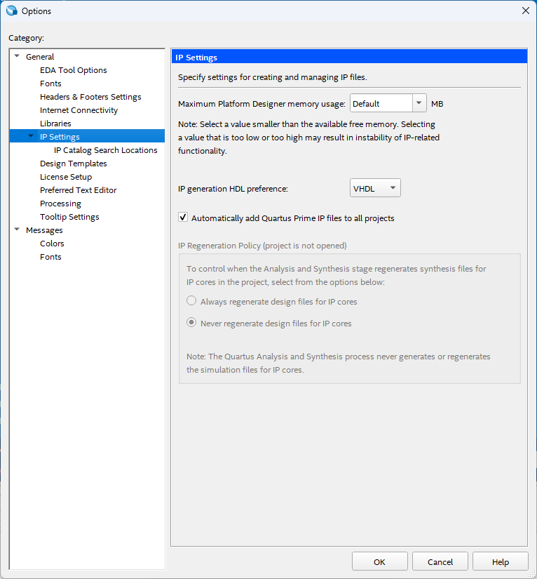
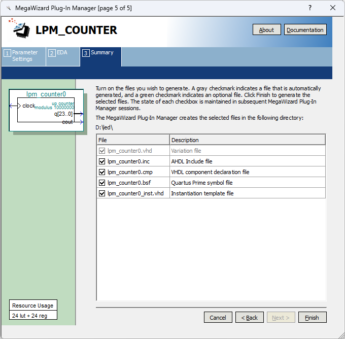
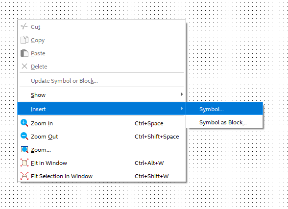
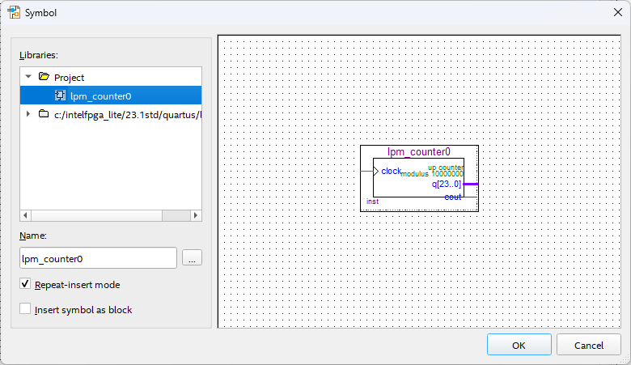

## Table of contents

## 查找 LPM_COUNTER
创建原理图后，在 `IP Catalog` 窗口搜索 `LPM_COUNTER` 。

## 选择创建的IP核变体类型
默认会保存在项目文件夹下，创建时注意要选择 `VHDL`。文件名不能使用 Quartus Prime 的IP核保留名。

若不小心使用了保留名，会弹出如下警告，请点击 `No` 并修改文件名。

### 修改IP核变体类型首选项
新安装的软件创建IP核变体首选项为 `Verilog`，如果需要将首选项改为 `VHDL`，请按照如下选项路径进行修改。
```
Tools -> Options -> IP Settings -> VHDL
```

## 进入 MegaWizard Plug-In Manager
这部分的参数有人写过，写的很清楚，我就不在这里赘述了，直接上链接
[https://blog.csdn.net/qq_47422985/article/details/130573789](https://blog.csdn.net/qq_47422985/article/details/130573789)

**最后一步一定要注意，这里要全选！！！**

## 导入创建的IP核变体
点击工具栏中的 Symbol Tool 图标

或在原理图中右键然后进行如下选择
```
Insert -> Symbol
```

最后在 Symbol Tool 的 Project 文件夹中就可以看到刚才创建的IP核变体了。

参考链接
[LPM Counter in Quartus](https://www.youtube.com/watch?v=Vd8e_qdZJts)
[FPGA学习笔记（九）——计数器IP核调用与验证](https://blog.csdn.net/qq_47422985/article/details/130573789)
